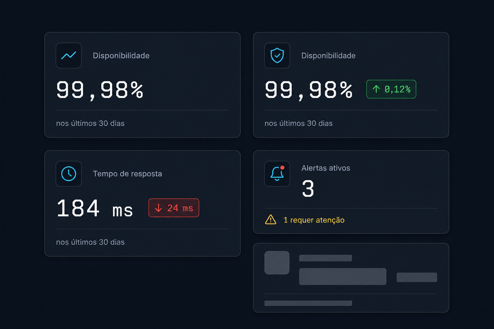

# Prompt — Stat / Metric Card



## Referência visual

A imagem relaciona a API proposta aos estados `default`, tendência positiva, tendência negativa, alerta e `loading`. O título corresponde a `StatCard.Label`, o número em destaque a `StatCard.Value`, a cápsula semântica a `StatCard.Trend` e a linha inferior a `StatCard.Description`.

Implemente no `arcsyn-io/ds` um componente composto `StatCard` para exibir indicadores e KPIs sem exigir composição ou CSS específico da aplicação.

## Objetivo

O componente deve representar métricas como disponibilidade, quantidade de deploys, latência, receita ou alertas. Ele precisa manter hierarquia visual consistente entre título, valor, variação e texto auxiliar.

## API sugerida

```tsx
<StatCard
  label="Disponibilidade"
  value="99,98%"
  description="Nos últimos 30 dias"
  trend={{ value: "0,12%", direction: "up", sentiment: "positive" }}
  icon={<ActivityIcon />}
/>
```

Ofereça também uma API composta para casos avançados:

```tsx
<StatCard.Root>
  <StatCard.Header>
    <StatCard.Label>Disponibilidade</StatCard.Label>
    <StatCard.Icon><ActivityIcon /></StatCard.Icon>
  </StatCard.Header>
  <StatCard.Value>99,98%</StatCard.Value>
  <StatCard.Trend direction="up" sentiment="positive">0,12%</StatCard.Trend>
  <StatCard.Description>Nos últimos 30 dias</StatCard.Description>
</StatCard.Root>
```

## Requisitos

- Variantes de densidade `compact` e `default`.
- Estados de tendência `up`, `down` e `neutral`.
- Sentimentos `positive`, `negative` e `neutral`, sem assumir que subir é sempre positivo.
- Suporte a `loading`, usando o `Skeleton` existente.
- Valor com numerais tabulares e fonte mono definida pelos tokens quando apropriado.
- Layout responsivo e suporte a valores longos.
- Ícone e tendência opcionais.
- Não incluir gráficos internamente; permitir um slot opcional `visualization`.
- Usar exclusivamente tokens do `@arcsyn-io/tokens`.
- Estilos em `@arcsyn-io/styles` e implementação React em `@arcsyn-io/react`.

## Acessibilidade

- Não depender apenas de cor ou seta para comunicar a tendência.
- Permitir `aria-label` para valores cuja leitura visual difere da leitura por leitor de tela.
- Marcar conteúdo decorativo como oculto para tecnologias assistivas.

## Entregáveis

- Tipos TypeScript públicos.
- Exports principal e dedicado.
- CSS sem valores de cor hardcoded.
- Exemplos de todas as variantes.
- Testes de renderização, estados, ref e propriedades HTML.
- Documentação explicando quando usar `StatCard`, `Card` ou `Badge`.

## Critérios de aceite

- O dashboard de exemplo consegue representar seus quatro KPIs sem CSS interno do componente.
- O componente funciona em todos os temas do ArcSyn.
- Nenhuma regra global ou seletor dependente da aplicação é necessário.
