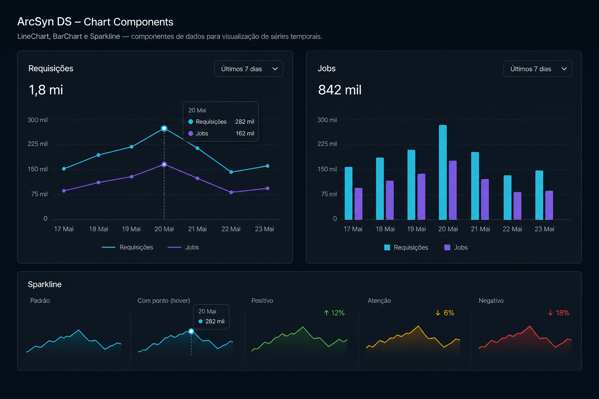

# Prompt — Charts



## Referência visual

A imagem demonstra a relação entre `LineChart`, `BarChart`, `Sparkline`, `ChartLegend` e `ChartTooltip`. As mesmas cores semânticas identificam cada série nos diferentes gráficos, enquanto a área inferior apresenta os estados positivo, atenção e negativo do `Sparkline`.

Implemente no `arcsyn-io/ds` uma base acessível de visualização de dados com `LineChart`, `BarChart` e `Sparkline`, integrada aos temas e tokens do ArcSyn.

## Objetivo

Permitir que dashboards mostrem séries temporais e comparações sem criar gráficos improvisados em CSS. A API deve ser declarativa, tipada e consistente entre os três componentes.

## API sugerida

```tsx
<LineChart
  aria-label="Requisições nos últimos sete dias"
  data={data}
  xKey="day"
  series={[
    { key: "requests", label: "Requisições", color: "accent" },
    { key: "jobs", label: "Jobs", color: "secondary" },
  ]}
  height={240}
/>
```

```tsx
<Sparkline
  aria-label="Disponibilidade crescente"
  values={[42, 55, 48, 66, 74, 86, 94]}
  sentiment="positive"
/>
```

## Requisitos

- Componentes `LineChart`, `BarChart`, `Sparkline`, `ChartLegend` e `ChartTooltip`.
- API comum para `data`, séries, cores semânticas, formatação e estados.
- Séries simples e múltiplas.
- Orientação vertical e horizontal para barras.
- Tooltip por teclado, mouse e toque.
- Legenda opcional e responsiva.
- Estados `loading`, `empty` e `error`.
- Redimensionamento responsivo sem exigir largura fixa.
- Cores derivadas de tokens com contraste suficiente entre séries.
- Suporte a modo claro, escuro e temas existentes.
- Preferir uma dependência pequena e tree-shakeable; documentar a decisão caso uma biblioteca externa seja adotada.
- Não expor diretamente detalhes da biblioteca de gráficos na API pública.

## Acessibilidade

- Exigir nome acessível ou descrição textual.
- Fornecer resumo tabular ou textual dos dados para leitores de tela.
- Não diferenciar séries apenas por cor; usar marcadores, padrões ou rótulos.
- Respeitar `prefers-reduced-motion`.
- Navegação por teclado entre pontos quando o gráfico for interativo.

## Entregáveis

- Tipos genéricos TypeScript para os dados.
- Tokens adicionais necessários para paleta de visualização.
- Implementação React e estilos ArcSyn.
- Exemplos com dados positivos, negativos, vazios e séries extensas.
- Testes de acessibilidade, formatação, responsividade e interação.
- Documentação com orientações para escolher o tipo correto de gráfico.

## Critérios de aceite

- Os gráficos do dashboard de exemplo podem ser construídos sem CSS customizado.
- Os dados continuam compreensíveis sem animação e sem percepção de cor.
- O bundle não inclui componentes de gráfico não utilizados.
