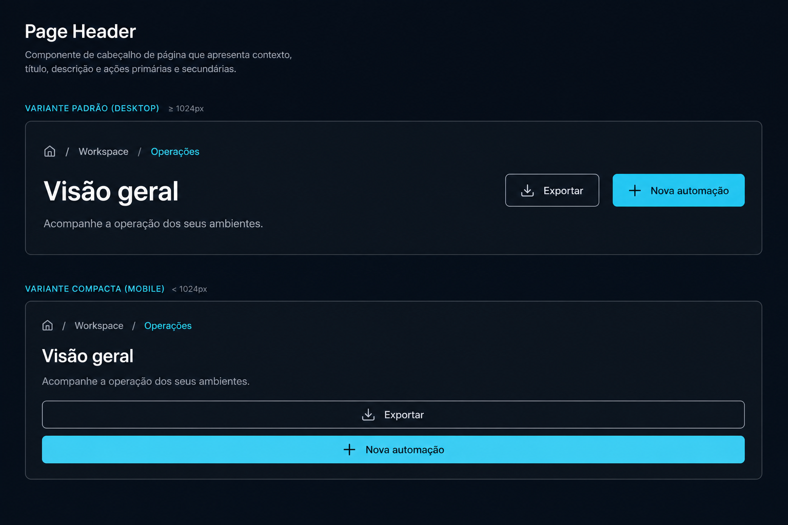

# Prompt — Page Header



## Referência visual

A imagem relaciona breadcrumb, título, descrição e ações aos slots de `PageHeader`. A primeira composição representa a variante `default`; a segunda mostra a variante `compact`, com as ações reorganizadas verticalmente para telas estreitas.

Implemente no `arcsyn-io/ds` um componente composto `PageHeader` para padronizar o início de páginas de aplicações e dashboards.

## Objetivo

Centralizar título, descrição, breadcrumb, metadados e ações da página, evitando cabeçalhos montados manualmente em cada produto.

## API sugerida

```tsx
<PageHeader>
  <PageHeader.Breadcrumb>
    <Breadcrumb>{/* itens */}</Breadcrumb>
  </PageHeader.Breadcrumb>
  <PageHeader.Content>
    <PageHeader.Eyebrow>Workspace</PageHeader.Eyebrow>
    <PageHeader.Title>Visão geral</PageHeader.Title>
    <PageHeader.Description>
      Acompanhe a operação dos seus ambientes.
    </PageHeader.Description>
  </PageHeader.Content>
  <PageHeader.Actions>
    <Button variant="outline">Exportar</Button>
    <Button>Nova automação</Button>
  </PageHeader.Actions>
</PageHeader>
```

## Requisitos

- Subcomponentes `Root`, `Breadcrumb`, `Content`, `Eyebrow`, `Title`, `Description`, `Metadata` e `Actions`.
- Variante `default` e `compact`.
- Suporte a título simples ou acompanhado por `Badge`, `Avatar` ou ícone.
- Ações alinhadas horizontalmente no desktop e reorganizadas no mobile.
- Possibilidade de tornar o cabeçalho sticky sem embutir regras específicas de aplicação.
- Slots opcionais; o componente deve funcionar somente com `Title`.
- Usar os componentes existentes do ArcSyn em exemplos e composições.
- Usar somente tokens de espaçamento, tipografia, borda e superfície.

## Acessibilidade

- Renderizar o título como `h1` por padrão.
- Permitir configurar o nível do heading sem perder os estilos.
- Preservar ordem lógica do conteúdo no mobile.
- Não ocultar ações importantes apenas por falta de espaço.

## Entregáveis

- API composta com tipos TypeScript.
- Exports e CSS no padrão atual do monorepo.
- Exemplos com breadcrumb, ações, descrição longa e layout mobile.
- Testes de semântica, ref, composição parcial e responsividade.
- Documentação de uso junto a `SidebarInset`.

## Critérios de aceite

- O topo do dashboard de exemplo não precisa de classes próprias para título e ações.
- A composição permanece alinhada em telas estreitas e com textos longos.
- Não há estilos acoplados a rotas, frameworks ou containers específicos.
