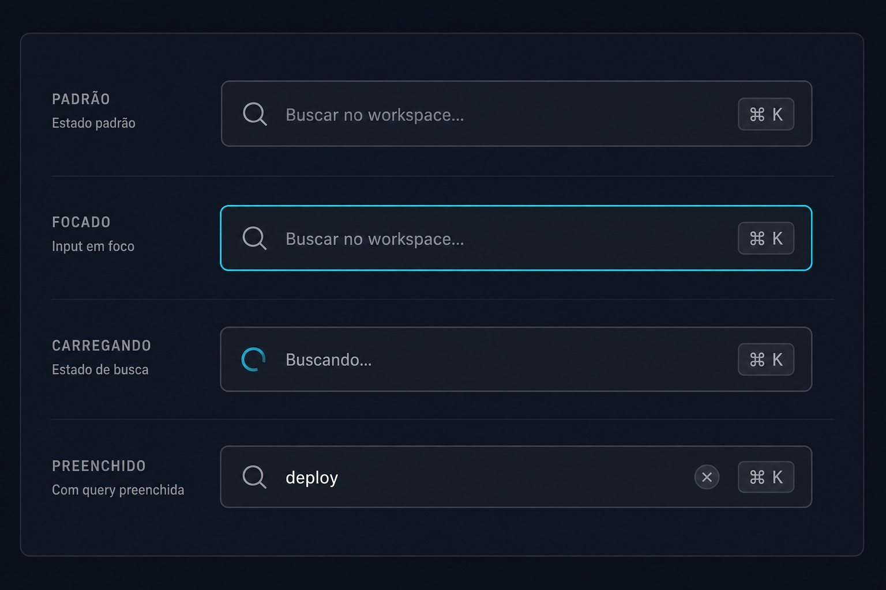

# Prompt — Search / Command Input



## Referência visual

A imagem apresenta quatro estados da mesma API: padrão, foco, carregamento e preenchido. O ícone ocupa o addon inicial, `Kbd` representa o atalho, o spinner substitui o ícone durante `loading` e o botão circular limpa o valor quando `clearable` está ativo.

Implemente no `arcsyn-io/ds` um componente `SearchInput` com suporte opcional a atalho de teclado e integração com uma command palette.

## Objetivo

Substituir a composição recorrente de `InputGroup`, `Input`, ícone e `Kbd` por uma API única e acessível para buscas locais ou globais.

## API sugerida

```tsx
<SearchInput
  value={query}
  onValueChange={setQuery}
  placeholder="Buscar no workspace..."
  shortcut="mod+k"
  onShortcut={() => setCommandOpen(true)}
  clearable
/>
```

## Requisitos

- Variantes de tamanho `sm`, `md` e `lg`, alinhadas ao `Input`.
- Ícone de busca oficial.
- Botão de limpar usando `Button` ou primitive interno equivalente do DS.
- Atalho opcional exibido por `Kbd`.
- Convenção multiplataforma para `mod`, exibindo `⌘` no macOS e `Ctrl` nos demais sistemas.
- Estados `disabled`, `invalid`, `loading` e `readOnly`.
- Suporte a input controlado e não controlado.
- Props para `onSubmit`, `onClear` e `onShortcut`.
- Integração opcional com um futuro `Command` sem tornar essa dependência obrigatória.
- Não duplicar comportamento já existente em `Input`; compor os primitives atuais.

## Acessibilidade

- Nome acessível obrigatório.
- Botão de limpar com rótulo traduzível.
- Atalho não deve capturar eventos enquanto o usuário digita em outro campo editável.
- `Escape` limpa ou fecha conforme o contexto, de forma documentada.
- Estado de carregamento anunciado sem remover o foco.

## Entregáveis

- Componente, tipos, estilos e exports.
- Novo ícone de busca no pacote oficial de ícones, caso ainda não exista.
- Exemplos de busca simples, busca global e abertura de command palette.
- Testes de teclado, foco, limpeza, atalhos e plataformas.
- Documentação de internacionalização dos rótulos.

## Critérios de aceite

- A busca do dashboard pode ser implementada sem CSS local ou composição manual.
- O componente permanece funcional sem atalho.
- O comportamento do atalho não interfere com inputs e áreas editáveis.
