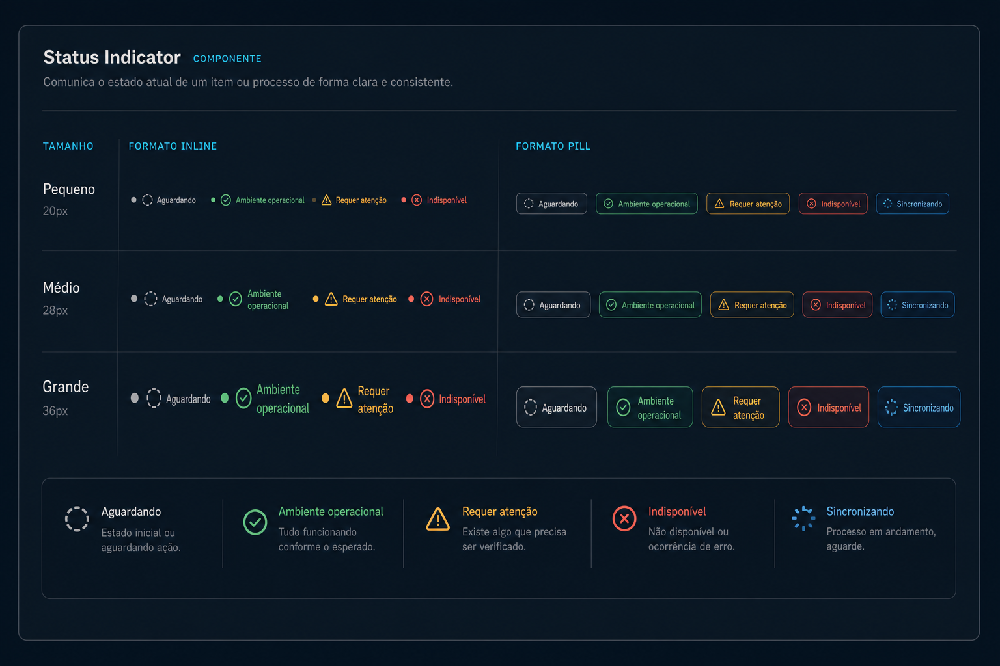

# Prompt — Status Indicator



## Referência visual

A matriz visual relaciona os tamanhos `sm`, `md` e `lg` aos formatos `inline` e `pill`. Cada coluna demonstra os estados neutral, success, warning, danger e loading, combinando texto com ponto, ícone ou spinner para não depender somente de cor.

Implemente no `arcsyn-io/ds` um componente `StatusIndicator` para comunicar estados operacionais, presença e sincronização.

## Objetivo

Cobrir casos nos quais `Badge` não é semanticamente suficiente, como “online”, “ambiente operacional”, “sincronizando” ou “serviço indisponível”.

## API sugerida

```tsx
<StatusIndicator
  status="success"
  label="Ambiente operacional"
  pulse
/>
```

```tsx
<StatusIndicator status="loading">
  Sincronizando alterações
</StatusIndicator>
```

## Requisitos

- Estados `neutral`, `info`, `success`, `warning`, `danger` e `loading`.
- Tamanhos `sm`, `md` e `lg`.
- Formatos `inline` e `pill`.
- Indicador visual opcional: ponto, spinner ou ícone.
- Animação `pulse` opcional, habilitada somente em estados adequados.
- Label visível por padrão; permitir modo somente ícone quando houver nome acessível.
- Suporte a conteúdo como `children` ou propriedade `label`.
- Usar tokens semânticos, `Spinner` e primitives existentes sempre que possível.

## Acessibilidade

- Nunca comunicar o estado apenas por cor.
- Permitir `role="status"` e `aria-live`, mas não ativá-los indiscriminadamente.
- Respeitar `prefers-reduced-motion`.
- Fornecer texto alternativo no modo somente ícone.

## Entregáveis

- Tipos, estilos, exports e exemplos.
- Demonstrações com estados estáticos e atualização em tempo real.
- Testes de semântica, animação reduzida e nomes acessíveis.
- Documentação comparando `StatusIndicator`, `Badge`, `Alert` e `Spinner`.

## Critérios de aceite

- O estado “Ambiente operacional” do dashboard usa apenas o novo componente.
- Todas as variantes funcionam em temas claros e escuros.
- A animação não é necessária para entender o estado.
