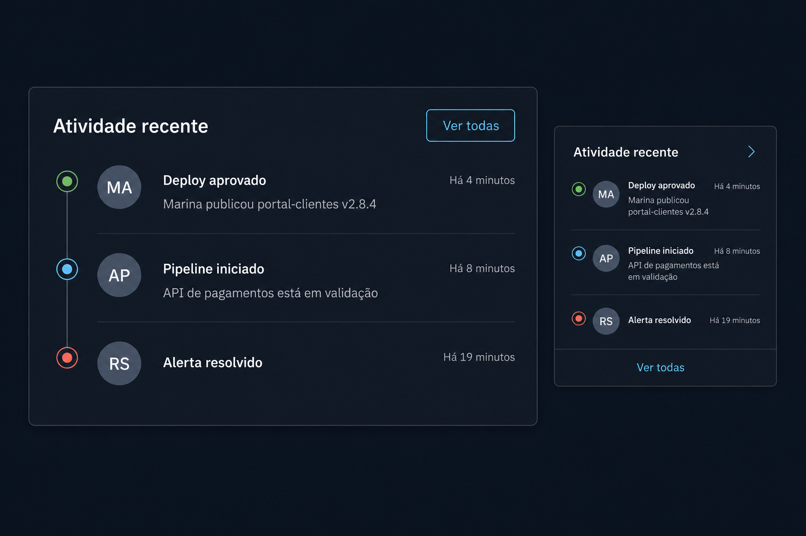

# Prompt — Activity Feed / Timeline



## Referência visual

A composição maior representa o modo `timeline`, com marcadores conectados, avatar, conteúdo e timestamp. A composição lateral representa o modo `feed` compacto. O botão “Ver todas” exemplifica o slot `ActivityFeed.Actions` ou `LoadMore`.

Implemente no `arcsyn-io/ds` um componente composto `ActivityFeed` para históricos, auditoria, notificações e eventos recentes.

## Objetivo

Padronizar listas cronológicas com ator, título, descrição, horário, status e ações sem exigir avatares, separadores e alinhamento manuais.

## API sugerida

```tsx
<ActivityFeed>
  <ActivityFeed.Item
    avatar={<Avatar id="marina" name="Marina Rocha" />}
    title="Deploy aprovado"
    description="Marina publicou portal-clientes v2.8.4"
    timestamp="Há 4 minutos"
    status="success"
  />
</ActivityFeed>
```

## Requisitos

- Subcomponentes `Root`, `Item`, `Actor`, `Title`, `Description`, `Timestamp`, `Icon`, `Actions` e `LoadMore`.
- Modos visuais `feed` e `timeline`.
- Suporte a `Avatar`, ícone ou indicador de status.
- Separadores gerenciados internamente.
- Estado compacto para sidebars e painéis estreitos.
- Ações opcionais por item usando componentes do DS.
- Agrupamento opcional por data.
- Estados `loading`, `empty` e paginação incremental.
- Conteúdo deve aceitar elementos React sem impor formato de dados específico.

## Acessibilidade

- Usar semântica de lista.
- Horário visual deve aceitar `dateTime` legível por máquina.
- Preservar ordem cronológica no DOM.
- Ações por item devem ter nome acessível e foco visível.
- Linha decorativa da timeline deve ser ignorada por leitores de tela.

## Entregáveis

- API composta, tipos, estilos e exports.
- Exemplos de feed simples, timeline, carregamento e ações.
- Testes de semântica, ordem, composição e teclado.
- Documentação diferenciando eventos, notificações e logs de auditoria.

## Critérios de aceite

- A área “Atividade recente” do dashboard não necessita CSS estrutural próprio.
- Avatares, separadores e timestamps permanecem alinhados com conteúdo multilinha.
- O componente funciona com e sem imagens de avatar.
