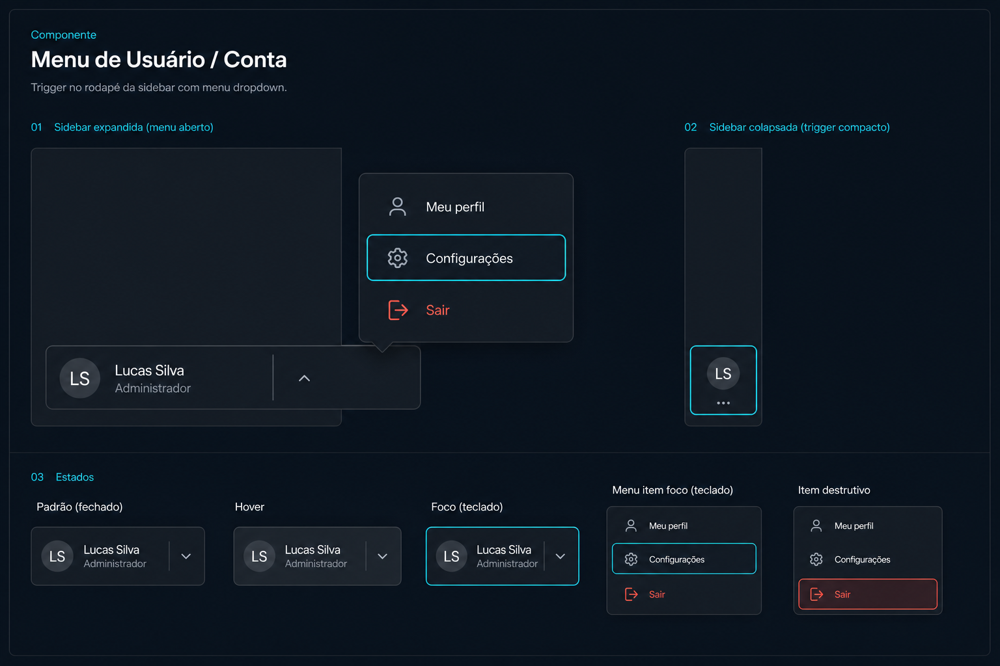

# Prompt — User / Account Menu



## Referência visual

A imagem relaciona o trigger expandido ao modo `sidebar`, o avatar isolado ao modo recolhido e o painel aberto ao `DropdownMenu` composto. A faixa inferior documenta os estados padrão, hover, foco por teclado e ação destrutiva.

Implemente no `arcsyn-io/ds` um componente composto `UserMenu` para representar o usuário atual e abrir ações de conta.

## Objetivo

Atender cabeçalhos e rodapés de sidebar com avatar, nome, descrição e menu de ações, sem composição específica em cada aplicação.

## API sugerida

```tsx
<UserMenu
  user={{
    id: "lucas-silva",
    name: "Lucas Silva",
    description: "Administrador",
    image: "/avatars/lucas.jpg",
  }}
  items={[
    { id: "profile", label: "Meu perfil", onSelect: openProfile },
    { id: "settings", label: "Configurações", onSelect: openSettings },
    { id: "logout", label: "Sair", tone: "danger", onSelect: logout },
  ]}
/>
```

## Requisitos

- Compor `Avatar`, `DropdownMenu` e ícones existentes.
- Variantes `default`, `compact` e `sidebar`.
- Suporte a nome, descrição, imagem e fallback do avatar.
- Itens comuns, separadores, labels de grupo e ação destrutiva.
- Estado aberto controlado e não controlado.
- Alinhamento configurável do menu.
- Compatibilidade com sidebar expandida e recolhida.
- No modo recolhido, manter tooltip com o nome do usuário.
- Não implementar autenticação; apenas a apresentação e as ações.

## Acessibilidade

- Trigger deve ser um botão real com nome acessível.
- Informar visualmente e via ARIA se o menu está aberto.
- Navegação completa por teclado.
- Foco deve retornar ao trigger ao fechar.
- A ação destrutiva deve ter tratamento semântico e visual, sem depender apenas de cor.

## Entregáveis

- Componente, tipos, estilos e exports.
- Exemplos no header e no `SidebarFooter`.
- Testes de teclado, foco, estados controlados e sidebar recolhida.
- Documentação de integração com dados de autenticação externos.

## Critérios de aceite

- O perfil no rodapé do sidebar do dashboard usa somente `UserMenu`.
- O componente mantém layout e tooltip corretos nos estados expandido e recolhido.
- Nenhum detalhe de provedor de autenticação faz parte da API.
