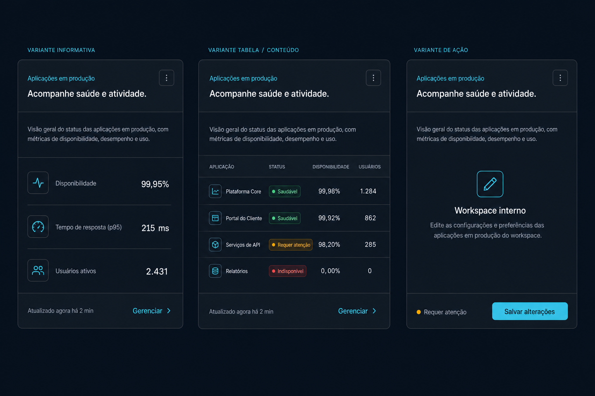

# Prompt — Composed Card



## Referência visual

As três colunas demonstram a mesma anatomia de `Card` aplicada a conteúdo informativo, tabela e ação. Cabeçalho, título, descrição, ações, conteúdo, separadores e rodapé correspondem diretamente aos subcomponentes propostos, sem exigir seletores baseados na ordem dos filhos.

Evolua o `Card` do `arcsyn-io/ds` para uma API composta, preservando compatibilidade com o componente atual.

## Objetivo

Oferecer hierarquia e espaçamento consistentes para cabeçalho, título, descrição, conteúdo e rodapé, reduzindo CSS repetido em dashboards e formulários.

## API sugerida

```tsx
<Card>
  <Card.Header>
    <Card.Heading>
      <Card.Eyebrow>Ambientes</Card.Eyebrow>
      <Card.Title>Aplicações em produção</Card.Title>
      <Card.Description>Acompanhe saúde e atividade.</Card.Description>
    </Card.Heading>
    <Card.Actions>
      <Button size="sm" variant="outline">Gerenciar</Button>
    </Card.Actions>
  </Card.Header>
  <Card.Content>{/* conteúdo */}</Card.Content>
  <Card.Footer>{/* ações ou metadados */}</Card.Footer>
</Card>
```

## Requisitos

- Preservar `<Card className="...">` como API válida.
- Adicionar `Card.Header`, `Card.Heading`, `Card.Eyebrow`, `Card.Title`, `Card.Description`, `Card.Actions`, `Card.Content` e `Card.Footer`.
- Variantes de padding `none`, `compact` e `default`.
- Opção `interactive` para cards clicáveis, com comportamento acessível claramente documentado.
- Suporte a header e footer com ou sem separador.
- Reflow das ações em telas estreitas.
- Usar somente tokens e componentes existentes.
- Evitar seletores dependentes da ordem exata dos filhos.

## Acessibilidade

- `Card.Title` deve permitir selecionar o nível de heading.
- Card interativo não pode conter controles interativos aninhados inválidos.
- Estado de foco e hover deve existir apenas quando houver interação.
- Descrição deve poder ser associada ao card quando necessário.

## Entregáveis

- API composta e tipos compatíveis com a versão atual.
- Estilos, exports e guia de migração.
- Exemplos de card informativo, formulário, tabela e card interativo.
- Testes de compatibilidade, composição parcial, headings e interação.

## Critérios de aceite

- Os cards de atividade, serviço e tabela do dashboard dispensam CSS para suas estruturas internas.
- Consumidores atuais não precisam alterar código.
- Padding e separadores permanecem consistentes em todas as combinações.
