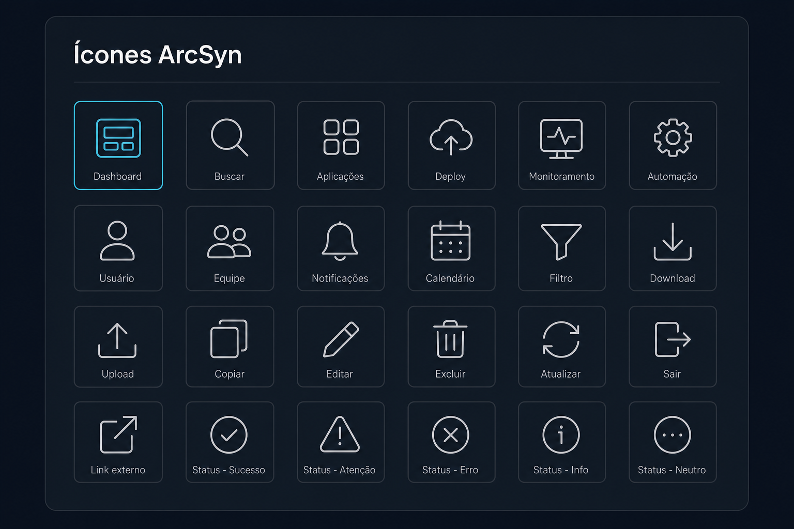

# Prompt — Expansão da biblioteca de ícones

## Referência visual

A imagem funciona como catálogo esperado para `@arcsyn-io/react/icons`: grade, tamanho óptico e peso de traço uniformes, labels com os nomes semânticos de export e um estado selecionado herdando a cor primária. Os ícones permanecem monocromáticos e sem significado de cor embutido.

Expanda os exports de ícones do `@arcsyn-io/react/icons` com um conjunto mínimo adequado para dashboards, ferramentas internas e aplicações operacionais.

## Objetivo

Evitar símbolos Unicode, imports diretos de bibliotecas externas e inconsistência de tamanho ou traço entre produtos que utilizam o ArcSyn DS.

## Ícones mínimos

- Busca, home e dashboard.
- Aplicação, grid e lista.
- Rocket/deploy, branch e commit.
- Monitoramento, atividade, pulso e gráfico.
- Automação, raio e workflow.
- Usuário, equipe, organização e conta.
- Bell, alerta, informação e sucesso.
- Calendário, relógio, filtro e ordenação.
- Download, upload, copiar, editar e excluir.
- Menu, logout, link externo e refresh.
- Manter todos os ícones já exportados.

## Requisitos

- Continuar usando a biblioteca vetorial já adotada internamente.
- Exportar nomes estáveis com sufixo `Icon`.
- Padronizar `size`, `strokeWidth`, `aria-hidden` e demais props.
- Permitir tree shaking.
- Não duplicar o código SVG no pacote.
- Criar uma página de catálogo pesquisável na documentação.
- Documentar política de inclusão, nomenclatura e depreciação.
- Adicionar aliases somente quando houver justificativa semântica clara.

## Acessibilidade

- Ícones devem ser decorativos por padrão nos exemplos quando acompanhados por texto.
- Documentar como fornecer nome acessível para ícones usados isoladamente.
- Não embutir significado ou cor fixa no SVG.

## Entregáveis

- Exports tipados em `@arcsyn-io/react/icons`.
- Catálogo com nome, visualização e exemplo de import.
- Teste garantindo que todos os exports resolvem individualmente.
- Teste ou verificação de tree shaking.
- Changelog com os novos nomes públicos.

## Critérios de aceite

- Sidebar, busca, ações e estados do dashboard não utilizam símbolos Unicode.
- Aplicações consumidoras não precisam importar diretamente a biblioteca subjacente.
- Todos os ícones herdam cor e aceitam os tamanhos recomendados pelo DS.
