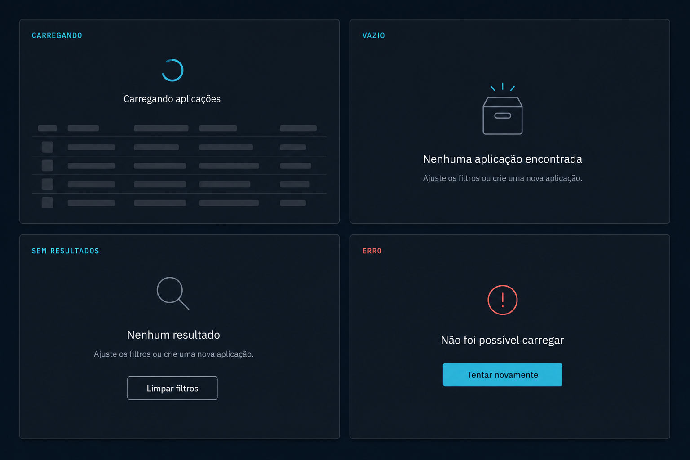

# Prompt — Data states



## Referência visual

Os quatro painéis relacionam diretamente os estados `loading`, `empty`, `no-results` e `error` à API de `DataState`. Skeletons representam carregamento de tabela; os demais estados combinam ícone, título, descrição e os slots de ação primária ou secundária.

Implemente no `arcsyn-io/ds` estados compostos de carregamento, vazio e erro para áreas de dados, integrados a `DataTable`, cards e painéis.

## Objetivo

Padronizar o comportamento durante carregamento, ausência de resultados e falhas, evitando mensagens, espaçamentos e ações diferentes em cada aplicação.

## API sugerida

```tsx
<DataState
  state="empty"
  title="Nenhuma aplicação encontrada"
  description="Ajuste os filtros ou crie uma nova aplicação."
  action={<Button>Nova aplicação</Button>}
/>
```

Integração sugerida:

```tsx
<DataTable
  data={data}
  columns={columns}
  loading={isLoading}
  emptyState={<DataState state="empty" title="Nenhum resultado" />}
  errorState={<DataState state="error" title="Não foi possível carregar" />}
/>
```

## Requisitos

- Componente `DataState` com estados `loading`, `empty`, `no-results`, `error` e `permission`.
- Tamanhos `compact`, `default` e `full`.
- Suporte a ícone, título, descrição, ação primária e ação secundária.
- Loading com quantidade configurável de skeletons.
- `no-results` semanticamente distinto de uma coleção realmente vazia.
- Integração oficial com `DataTable`.
- Possibilidade de uso dentro de `Card`, `Dialog`, `Drawer` e áreas independentes.
- Compor `Empty`, `Skeleton`, `Alert`, `Button` e outros primitives existentes, evitando duplicação.
- Textos fornecidos pelo consumidor para permitir internacionalização.

## Acessibilidade

- Mudanças assíncronas importantes devem poder usar `role="status"` ou `role="alert"` conforme o caso.
- Loading deve informar um rótulo acessível.
- Ações devem receber foco somente quando apropriado, sem roubar foco automaticamente.
- Ícones decorativos devem ser ocultados de leitores de tela.

## Entregáveis

- Componente, tipos, estilos e exports.
- Extensão compatível da API de `DataTable`.
- Exemplos de todos os estados em densidades diferentes.
- Testes de estados assíncronos, semântica, ações e integração com tabela.
- Documentação sobre escolha entre `empty`, `no-results`, `error` e `permission`.

## Critérios de aceite

- Tabelas e cards podem tratar todo o ciclo de dados sem componentes customizados.
- A transição entre loading, conteúdo, vazio e erro não causa salto de layout excessivo.
- A integração com `DataTable` preserva seleção, filtros e paginação quando aplicável.
